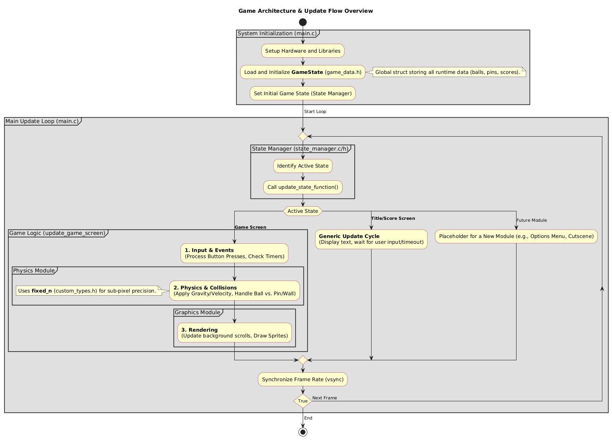
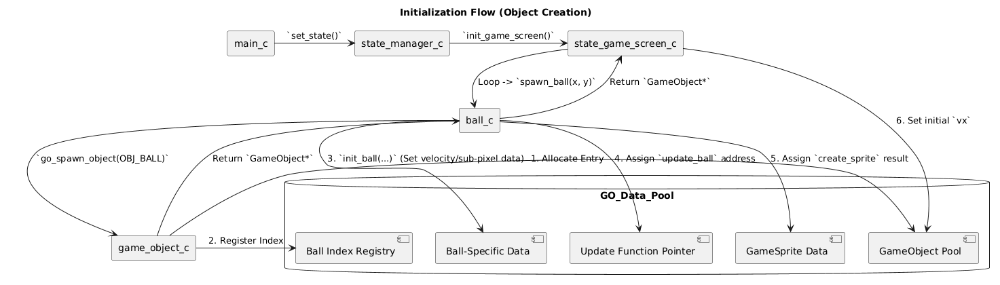
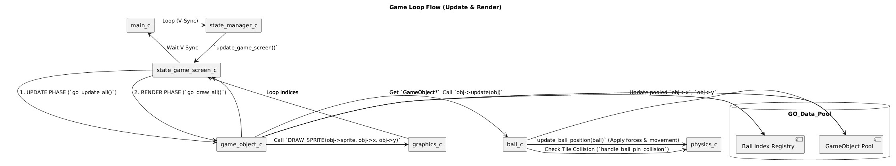

# Splatter Boy

## About

A "fun" little project where I mess around with C and GBDK. Attempt at a pachinko-like "game" with decent _ball physics_.

This is in __VERY EARLY__ stages.

## Current Features

- **Custom 8.8 Fixed-Point Physics** Implements a fixed-point number system for sub-pixel movement and velocity
- **Ball Physics:** Includes gravity, maximum speed enforcement, and functions for initial ball launch and instant velocity impulse application.
- **Ball-Pin Collision:** Logic supports two distinct interactions based on vertical velocity: **high-speed bounce** with velocity retention and **low-speed rolling** along the pin surface.
- **Background-Mapped Collision:** Pin collision is detected by reading the background tilemap (`PIN_TILE_ID`), allowing for level designs where pins are part of the level geometry rather than individual sprites.
- **Game State Management:** Finite state machine implementation and centralised structure

## Setup Developer Environment

Dev environment is Win11 with VSCode using Make. Compiler is LCC.exe included with GBDK2020.

_**note**: These are steps for Windows. For linux GBDK will need installing and a Makefile creating to compile. There is a `Makefile_linux` provided, but this might not be correct._

Follow these steps to get started:

1. `git clone https://github.com/rookzone/splatter-boy.git`
2. `cd splatter-boy`
3. `code .` Open VSCode - make sure you are in the splatter-boy workspace (_check with `pwd`_).
4. Download or install [GBDK 2020](https://gbdk.org) (v4.4.0) and copy the contents into the root.
5. Install [make for windows](https://gnuwin32.sourceforge.net/packages/make.htm)
6. Download [BGB emulator](https://bgb.bircd.org) and place in `emu/BGB` (_BGB is used as it has certain debugging features that interact with GBDK_)
7. `make` and it will create the .gb file in the `build/` directory
8. Use below in .vscode/tasks.json. This will set it up to build and then launch straight into BGB on CTRL+SHIFT+B

**.vscode tasks.json**

```JSON
{
  "version": "2.0.0",
  "tasks": [
    {
      "label": "Build GameBoy ROM",
      "type": "shell",
      "command": "make",
      "group": {
        "kind": "build",
        "isDefault": false
      },
      "problemMatcher": [],
      "options": {
        "cwd": "${workspaceFolder}"
      }
    },
    {
      "label": "Run in Emulator",
      "type": "shell",
      "command": "powershell",
      "args": [
        "-Command",
        "& '${workspaceFolder}/emu/BGB/bgb.exe' '${workspaceFolder}/build/splatter-boy.gb'"
      ],
      "dependsOn": "Build GameBoy ROM",
      "group": {
        "kind": "build",
        "isDefault": true
      },
      "problemMatcher": [],
      "options": {
        "cwd": "${workspaceFolder}"
      }
    }
  ]
}

```

## Structure

### Execution Flow



### Data Layout


## Programming Styles

**Functions and Variables**

*snake_case, lower-case*

e.g 

`update_ball_physics`
`uint_8 ball_center_position`

**Macros and Defines**

*SNAKE_CASE, CAPITAL*

e.g.

`DRAW_SPRITE`
`MAX_GAME_OBJECTS`

**Structs, Typedefs, Enum, Union - "Custom Types"**

PascalCase

e.g.

`GameObject`
`GameSprite`
`GameState`
`Game`
`Ball`

**C styles**:

https://www.cs.umd.edu/~nelson/classes/resources/cstyleguide

https://www.kernel.org/doc/html/v4.10/process/coding-style.html

## LATEST BIG UPDATE: **Generic Game Objects ECS**

**04/12/2025**

The game now manages generic objects centrally, which allows creation of any game object with it's own unique attribute structure, and it's execution code. This has improved seperation of concerns by moving out a lot of object specific code into it's appropriate file.

The state_game_screen code is now a lot less messy, and a lot of the ball initilisation and updating takes place in ball.c.

The game objects themselves are maintained in another file, which becomes a location to fetch game object data.

this will be improved with more functions to manage the game object pool, to manipulate objects in certain ways. This also lays the ground work for encapsulating the game_data structure further for things like input, sound etc.

### Object Management Architecture (ECS Pattern)

The project now uses a Game Object Manager based on a highly optimized, custom Entity-Component-System (ECS) pattern, designed specifically for the Game Boy's limited resources.

1. The Entity (GameObject)
All active game entities (balls, pins, etc.) are stored in a fixed-size array called the game_object_pool (the Entity Pool).

The generic GameObject struct acts as the Entity (or container). It holds the basic, mandatory data: screen position (x, y), active status, a sprite reference (GameSprite), and crucially, a function pointer (UpdateFunc update).

2. The Components (Specific Data)
Specific data for each type of object (e.g., vx, vy, sub_x, sub_y for a ball) is stored in a union data member within the GameObject.

The Ball struct is therefore the Component, holding the unique state required for the physics system to operate.

3. The System (Update Logic)
The update function pointer is assigned the address of a type-specific logic function (e.g., update_ball in ball.c). This separates the generic container from its unique behavior.

Functions like update_ball are the Systems that process the Component data. These functions contain the logic for physics integration and collision resolution.

4. Execution & Optimization
The system is optimized for CPU efficiency by avoiding a costly linear search over the entire pool.

A structure called ObjectIndices maintains a separate, compact array of pool indices (ball_indices) only for active objects of a specific type.

The main update loop, go_update_all(), iterates only over these small index arrays. For each index, it retrieves the GameObject from the main pool and calls its assigned update(obj) function pointer.

This approach ensures fast, targeted processing, as the system knows exactly which objects to update without wasting cycles.

### Visualization

The flow of data and control is highly centralized within this architecture.

Creation Flow (PlantUML Diagram):



Game Loop Flow (PlantUML Diagram):


---

## Current Focus

### Current TODO

Check TODO.md for change history

**06/12/2025**

Reset focus after Game Object and Game State architecture.

### **Title screen with text and state transition**

- [ ] Create title screen BG graphics
- [ ] Build font tile-set
- [ ] Function to convert string into text @ tile_index on screen. Can parse newline and other chars in string
- [ ] On press start transition into Game State, check VRAM and data structures for cleanliness

### **Game Object Saftey**

- [ ] On create of Game Object, each type needs safety handling to prevent too many being created.
- [ ] Function to clean out game data on state transition

### **Graphics Safety**

- [ ] Read VRAM for usage. Use this to build safety and cleaning for state transitions.

### **New "physics"**

- [ ] Migrate collision tile checker to physics.c/.h
- [ ] Improve collision tile checker function to pick up contact within multiple tiles
- [ ] 45 degree walls vs ball collision implementation

**Tweaks**

- [ ] Add a bit of randomness to balls on bounce (very small amount)

---

### Project

- ~~Structure diagram Show how GameState works, memory pointers and arrays for data, custom types, engine functionalities, and state specific code and the loop https://plantuml.com diagrams added.~~

- Wiki / Docs
- Possible in-line asm optimisations
- Versioning
- GDD (Game Design Document) with full feature requirments

## Dev Tools


### Graphics Tools

Community tools for creating tilesets and background maps:

[Game Boy Tile Designer](http://www.devrs.com/gb/hmgd/gbtd.html) - tilesets

[Game Boy Map Builder](http://www.devrs.com/gb/hmgd/gbmb.html) - background maps

This is super useful for turning images into PNGs compatible with Game Boy

[Image to GB](https://github.com/systemoflevers/image_to_gb)

Check out png2Asset in gbdk bin directory. Pass an image (Generated from above).
Will output a tileset and background map that is ready to use.

### Sound Tools

 ...

## AI Usage

There is no copy/paste AI code in this project (except the Makefiles...). AI has been used to suggest documentation, provide a basic review of the code, and assist with comments and commit messages. This is a concious choice by myself, AI code is ok so long as the contributer understands what the code does. An issue I found with AI and this sort of works is that AI tends to add lots of extraneous code, which for a performance critical project like this, becomes a hinderance quite quickly.

## License

This project uses the MIT License. Any third-party tools including GBDK and png2asset have their respective licenses are provided in the `licenses` directory.