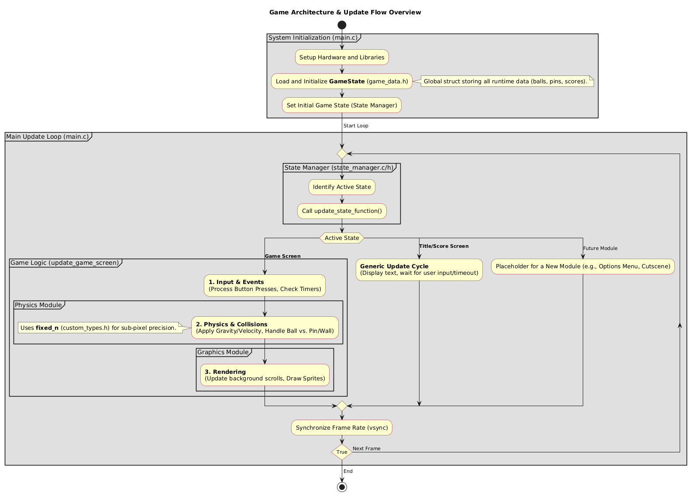
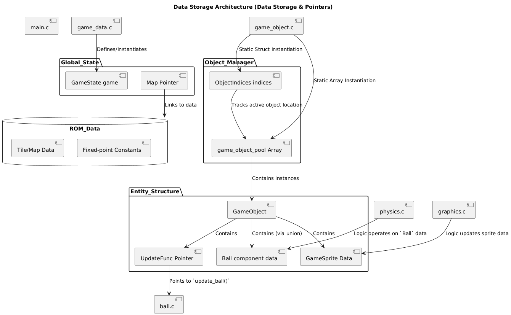

# Splatter Boy

## About

A fun little project where I mess around with C and GBDK. Attempt at a pachinko-like "game" with decent ball physics.

This is in **_VERY EARLY_** stages.

GDD is google doc here[https://docs.google.com/document/d/1b7yYHS2PwsaXc8w60WU_YoptCUdReH6eddsxONNQ60Y/].

## Current Features

- **Custom 8.8 Fixed-Point Physics** Implements a fixed-point number system for sub-pixel movement and velocity
- **Ball Physics:** Includes gravity, collision, bounce, rolling, and sub-pixel precision
- **Ball-Pin Collision:** Logic supports two distinct interactions based on vertical velocity: **high-speed bounce** with velocity retention and **low-speed rolling** along the pin surface.
- **Background-Mapped Collision:** Pin collision is detected by reading the background tilemap (`PIN_TILE_ID`), allowing for level designs where pins have "built-in" collision. This saves VRAM and a LOT of CPU
- **Game State Management:** Finite state machine implementation and centralised game data structure. Allows for easy reset, save state, and change state (i.e. screen, level)

## Setup Developer Environment

This repo supports the same basic workflow on Windows and Linux:

- `make` builds `build/splatter-boy.gb`
- `make run` builds and launches the ROM in an emulator

On Linux, the minimum requirements are:

- Bash
- GNU Make
- `curl`
- `tar` with gzip support
- `ca-certificates`
- GBDK-2020
- mGBA if you want `make run`

Fresh Linux quick start:

```bash
./scripts/setup-linux.sh
```

That script will:

- install missing base packages with `apt-get`, `dnf`, `pacman`, or `zypper` when available
- download the latest official GBDK Linux release into `./.gbdk/`
- download the latest official mGBA Linux AppImage into `./emu/mgba/`
- create a local `emu/mgba/mgba` launcher so `make run` works on systems without separate AppImage/FUSE setup

Follow these steps to get started:

1. `git clone https://github.com/rookzone/splatter-boy.git`
2. `cd splatter-boy`
3. `code .` Open VSCode if you want editor tasks and launch configs.
4. Install [GBDK-2020](https://gbdk.org). The `Makefile` will look for `lcc` in this order:
    - `GBDK_LCC=/full/path/to/lcc`
    - `.gbdk/bin/lcc` on Linux or `.gbdk/bin/lcc.exe` on Windows
    - `bin/lcc` on Linux or `bin/lcc.exe` on Windows
    - `GBDK_HOME=/path/to/gbdk`
    - `lcc` on `PATH`
5. Install GNU Make. On Windows, `make` or `mingw32-make` on `PATH` both work with the helper scripts.
6. Install [mGBA](https://mgba.io/) and either put it on `PATH` or place it in `emu/mgba/`.
   The `run` target prefers mGBA on both platforms and still falls back to `emu/BGB/bgb.exe` on Windows if you already use BGB there. On Linux, `scripts/setup-linux.sh` installs a local wrapper at `emu/mgba/mgba`.
7. Run `make`
8. Run `make run`

Helper scripts are also included:

- Linux: `./scripts/build.sh` and `./scripts/run.sh`
- Windows: `scripts\\build.bat` and `scripts\\run.bat`

If your paths are unusual, these overrides are supported:

- `make GBDK_HOME=/path/to/gbdk`
- `make GBDK_LCC=/full/path/to/lcc`
- `make run GB_EMULATOR=/full/path/to/mGBA`
- `make doctor` prints the resolved tool paths

Use the sample VS Code task files in `resources/CONFIGS/vscode/` if you want `Ctrl+Shift+B` to call the same portable `make` targets.

## Structure

### Execution Flow



### Data Layout



## Programming Styles

**Functions and Variables**

*snake_case, lower-case*

e.g 

`update_ball_physics`
`uint_8 ball_center_position`

**Macros and Defines**

*SNAKE_CASE, CAPITAL*

e.g.

`DRAW_SPRITE`
`MAX_GAME_OBJECTS`

**Structs, Typedefs, Enum, Union - "Custom Types"**

PascalCase

e.g.

`GameObject`
`GameSprite`
`GameState`
`Game`
`Ball`

**C styles**:

https://www.cs.umd.edu/~nelson/classes/resources/cstyleguide

https://www.kernel.org/doc/html/v4.10/process/coding-style.html

## Current Focus

### Code

-~~Font loading and text display~~
- ~~build encapsulated input system~~
- **Measure time between any two points** ~~in the code execution would be useful.~~
  - Check BGB emu functions...
~~Optimisation will need looking at again.~~
- Sound system

### Project

- ~Structure diagram (Show how GameState works, memory pointers and arrays for data, custom types, engine functionalities, and state specific code and the loop)~ - **done** https://plantuml.com diagrams added.
- Wiki / Docs
- Possible in-line asm optimisations
- Versioning

## Dev Tools

Useful command to combine source code into a single document.

```powershell
Get-ChildItem -Recurse -File | Where-Object { $_.Name -ne "combined.txt" } | ForEach-Object { Get-Content $_.FullName -Raw } | Out-File combined.txt -Encoding utf8
```

### Graphics Tools

Community tools for creating tilesets and background maps:

[Game Boy Tile Designer](http://www.devrs.com/gb/hmgd/gbtd.html) - tilesets

[Game Boy Map Builder](http://www.devrs.com/gb/hmgd/gbmb.html) - background maps

This is super useful for turning images into PNGs compatible with Game Boy

[Image to GB](https://github.com/systemoflevers/image_to_gb)

Use a tool like Image to GB to generate a 4 colour png at 144x160.
Use `png2asset <filename> -map` to generate a background.
Place output into src
Remove includes and make sure both tile arrays are of type `unsigned char`
Pass tiles and map + number of tiles to set bg e.g...
`set_game_background(game2Map, PanchinkoTiles, 16);`

### Sound Tools

 ...

## AI Usage

There is no copy/paste AI code in this project (except the Makefiles...). AI has been used for documentation, comments, commit messages, and code reviews. Assuming anyone contributes, AI code is fine as long as they understand what it does. An issue I found with AI and a low-level project like this is that AI tends to add a lot of extraneous code, which for a performance critical project like this, becomes a problem quite rapidly.

## License

This project uses the MIT License. Any third-party tools including GBDK and png2asset have their respective licenses are provided in the `licenses` directory.
